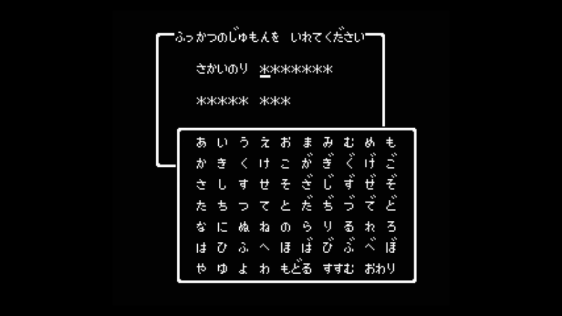
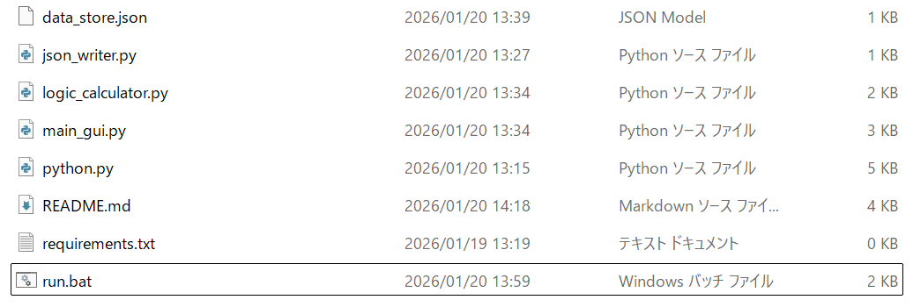
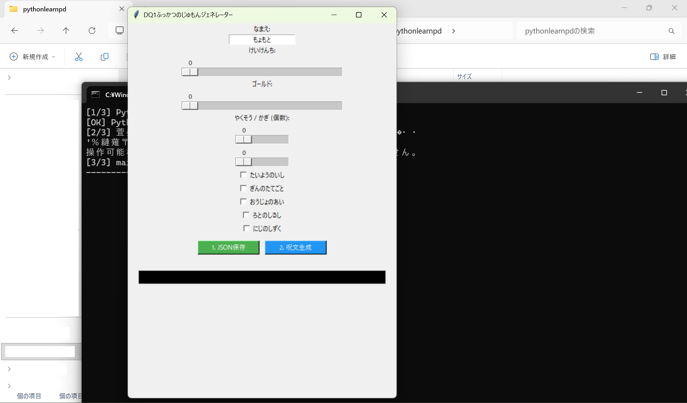
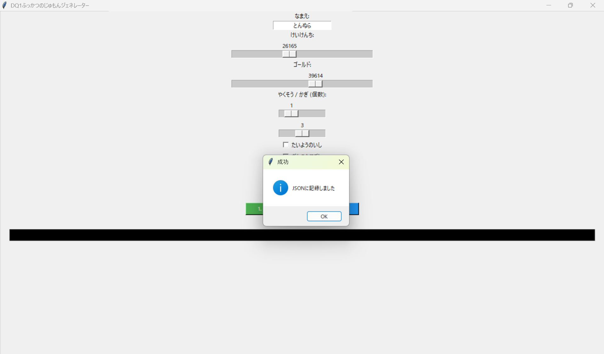
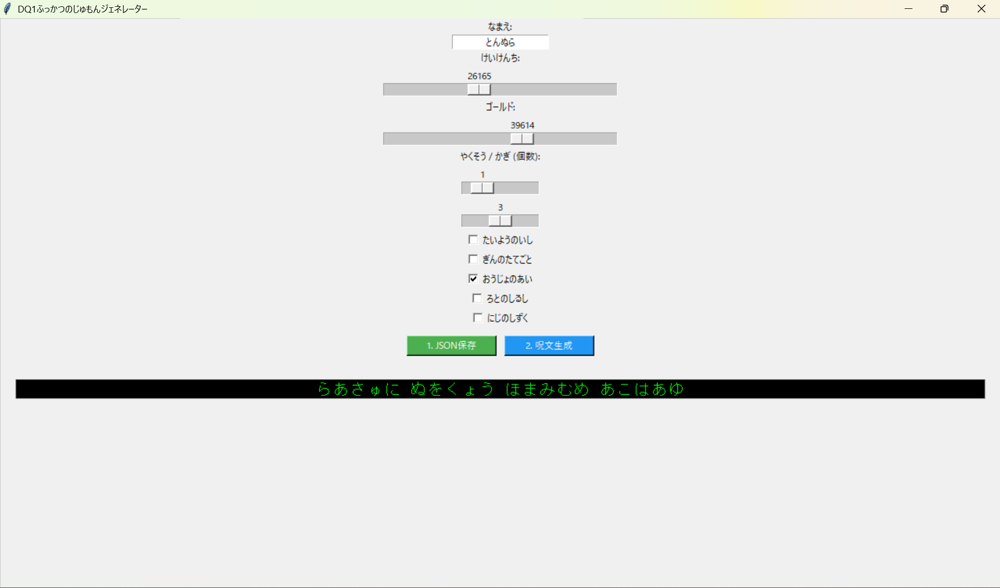

# ドラクエのふっかつのじゅもんジェネレーター

## 概要
ファミリーコンピュータ版『ドラゴンクエストI』の「ふっかつのじゅもん」を、入力したステータスに合わせて自動生成するツールです。当時のアルゴリズムを参考に、実際にゲーム内で使用可能な文字列を出力します。

↓ドラゴンクエストIの実際のゲーム画面

制作時期：2026年1月

## セットアップ
本ツールはWindows環境での動作を想定しています。

1. `git clone` でリポジトリをクローンします。
2. `root` フォルダ内にある `run.bat`（または該当のbatファイル名）を実行してください。
※入力情報は `data_store.json` に保存され、そこから呪文が生成されます。

---

## 機能説明
### 使い方
直感的なUIで、ドラクエIの世界へ戻るための呪文を作成できます。

#### 1. ステータス入力画面

アプリを起動すると、冒険者の名前や現在の進行状況を入力する画面が表示されます。以下の項目を設定してください。

* **なまえ**: 最大4文字まで（ひらがな・濁点・一部記号）。
* **経験値・所持金**: ゲーム内の上限値まで設定可能。
* **所持アイテム**: 武器、防具、だいじなもの（ロトのしるし等）の有無。

入力が完了したら、画面指示に従い **「1.jsonに保存」** ボタンをクリックした後、 **「2.呪文生成」** ボタンをクリックしてください。

生成が完了すると、画面中央に20文字の「ふっかつのじゅもん」が表示されます。これを実際のゲーム画面で入力してください。

---

### 生成アルゴリズムについて
本ツールは、単なるランダム生成ではなく、当時の仕組みをシミュレートしています。

1. **データのパッキング**
   名前、経験値、アイテムなどの数値を、ビット列（0と1の並び）へ変換・圧縮します。
2. **並び替え（シャッフル）**
   特定の規則に従ってデータの順番を入れ替えます。
   *(※現段階では暫定的な実装ですが、将来的に完全な解析アルゴリズムへ更新予定です)*
3. **文字置換**
   最終的な数値を、ドラクエ独自の「64種類のひらがな」に割り当てて呪文を完成させます。

> [!IMPORTANT]
> **名前に紐づく仕様**
> 「ふっかつのじゅもん」は名前に依存して生成されます。同じステータスでも、名前が1文字違うだけで呪文は全く別物になります。

---

### 今後のアップデート予定
* **逆引き機能の実装**: 呪文を入力すると、その内容（レベルや所持品）を解析して表示する機能。
* **正確なチェックサムの実装**: 当時の計算式を100%再現し、より確実な呪文生成を目指します。